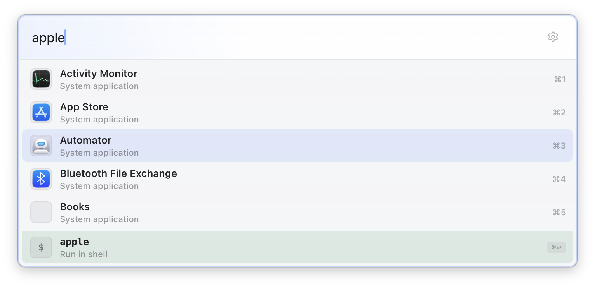
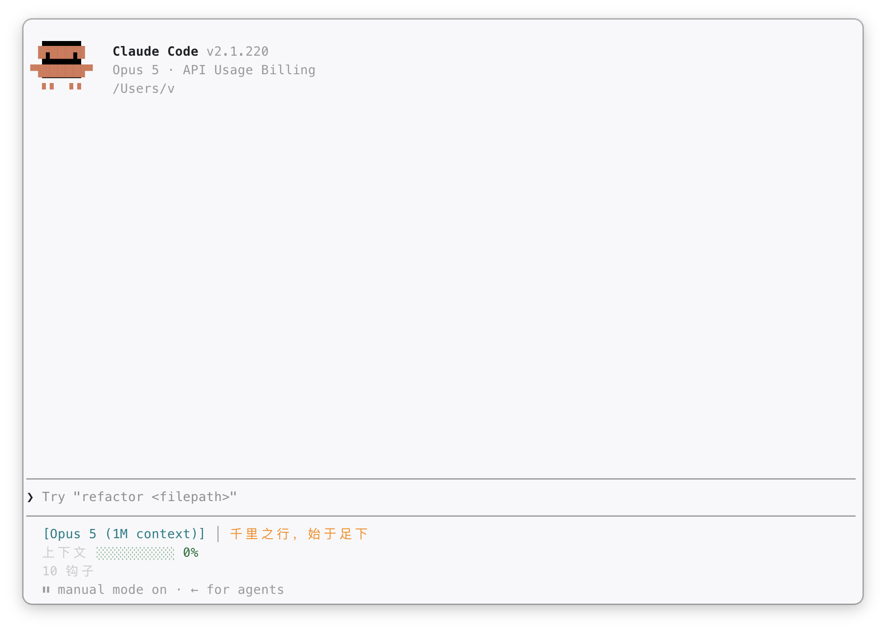
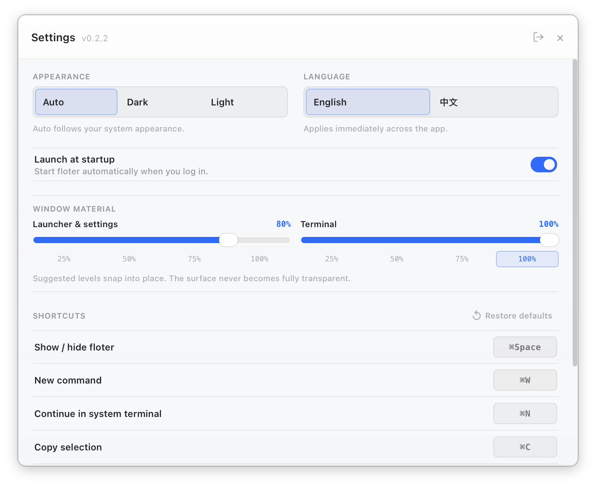

# floter

跨平台悬浮终端与应用启动器，一个快捷键随叫随到。

[English](README.md) · **简体中文**

## 功能

- **悬浮终端：** 默认按 `Ctrl+Space`，即可随时显示或隐藏完整的 256 色 shell。
- **智能应用启动器：** 自动扫描 macOS、Linux 和 Windows 中已安装的应用，支持模糊匹配及中文应用名的拼音首字母搜索。
- **操作栏：** 自动识别 URL、文件系统路径和 shell 输入；按 `Cmd+Enter`（macOS）或 `Ctrl+Enter`（其他平台）即可打开或运行。
- **多显示器支持：** 在当前使用的显示器上出现，也可在系统终端中继续处理终端任务。
- **终端会话持久化：** PTY 由 Floter 后台 broker 持有，移交后的会话仍可重新连接。
- **个性化设置：** 可选择深色、浅色或自动主题，调整透明度和界面语言，并重新绑定快捷键。
- **内置更新：** 自动检查新版本，并可直接在应用内完成安装。

## 截图







## 安装

### 一键安装（推荐）

```bash
curl -fsSL https://raw.githubusercontent.com/vst93/floter/main/scripts/install.sh | bash
```

选项：

```bash
# 安装最新版本（含预览版）
curl -fsSL ... | bash -s -- --pre-release

# 安装指定版本
curl -fsSL ... | bash -s -- --version 0.3.0

# 非交互式安装（跳过所有确认，适合自动化）
curl -fsSL ... | bash -s -- --yes

# 无提示安装预览版
curl -fsSL ... | bash -s -- --pre-release --yes
```

### 手动下载

前往 [GitHub Releases](https://github.com/vst93/floter/releases) 下载最新版本。

| 平台 | 下载文件 | 安装方式 |
| --- | --- | --- |
| macOS | `.dmg` | 打开镜像，将 **floter** 拖入「应用程序」。 |
| Linux | `.deb` 或 `.rpm` | 用发行版的包管理器安装。 |
| Arch / CachyOS / Manjaro | — | `cd packaging/arch && makepkg -si`（[PKGBUILD](packaging/arch/PKGBUILD)，基于发布的 `.deb` 重新打包）。 |
| Windows | `.exe` | 运行安装程序。 |

同时也提供 `.AppImage`，供上述安装包都不适用的发行版使用。能用原生包就用原生包：AppImage
自带构建时的 GTK 与 WebKit 库，在滚动发行版上，这些库会比系统里的显卡驱动更旧——下面那个
EGL 报错通常就是这么来的。

### macOS：未签名应用

floter 目前尚未进行代码签名。若安装后 macOS 提示应用「已损坏」，请运行：

```bash
xattr -cr /Applications/floter.app
```

然后从「应用程序」中重新打开 floter。

### Linux：floter 启动不起来

如果窗口始终不出现，终端里出现类似这样的报错：

```text
Could not create default EGL display: EGL_BAD_PARAMETER
```

说明 WebKitGTK 拿不到 GPU。这在 Wayland + AMD 显卡 + 较新 Mesa 的组合上很常见。

floter 会识别出「上一次启动没能走到窗口」，并让下一次启动自动不用 GPU，所以**先再启动一次**
试试。也可以直接指定：

```bash
floter --software-rendering   # 始终不用 GPU
floter --gpu                  # 始终用 GPU，即使上次启动失败
```

同样的开关也可以写成环境变量 `FLOTER_SOFTWARE_RENDERING=1`（或 `=0`），便于写进桌面项或
service 文件。如果软件渲染也无济于事，可以让 floter 走 XWayland：

```bash
GDK_BACKEND=x11 floter
```

如果你用的是 AppImage，请改装发行版对应的安装包——用系统自身的库链接出来的 WebKit 才是根治办法。

## 终端会话

点击启动器输入框旁的终端图标，或打开「设置 → 会话」，即可恢复或终止持久化
会话。未连接的会话仍会继续运行；“未连接”只表示当前没有终端客户端在显示它。

也可以无需打开界面，直接查看和管理后台会话：

```bash
floter terminal list
floter terminal attach <session-id>
floter terminal switch <session-id> --terminal kitty
floter terminal kill <session-id>
```

Unix 平台上的 `switch` 可指定已安装的 `kitty`、`ghostty`、`alacritty`、`wezterm`
等终端。关闭 attach 的终端客户端只会 detach；只有显式执行 `kill` 才会终止 PTY 会话。

## 更新

floter 会在启动时检查更新。发现新版本后，打开「设置」并选择「下载并安装」。更新完成后，floter 会自动重新启动。

## Wayland

Wayland 的全局快捷键由合成器管理。请将以下命令绑定为自定义快捷键：

```bash
floter --toggle
```

- **GNOME：** 设置 → 键盘 → 自定义快捷键
- **KDE：** 系统设置 → 快捷键 → 自定义快捷键

## 许可证

[GPL-3.0](LICENSE)
